# 
<h1 align="center">
      <i class="fas fa-calendar-day" aria-hidden="true">  Learning Path to C++ </i>
</h1>

***
C++ is one of the most widely used programming languages worldwide.
It provides a solid basis for any programmer's skill set, and it is utilized for everything from systems-level programming to mobile app development.

This repository is for those who don't have a background in software development but wish to learn C++. 

<h2 align="center">
      <i class="fas fa-calendar-day" aria-hidden="true">  Day 1 of C++ journey </i>
</h2>

Printing "Hello world" in the terminal
- [Day 01](day01)

### Lessons Learned

- [x] iostream
- [x] Print out "Hello world!" in the terminal

### Screenshots

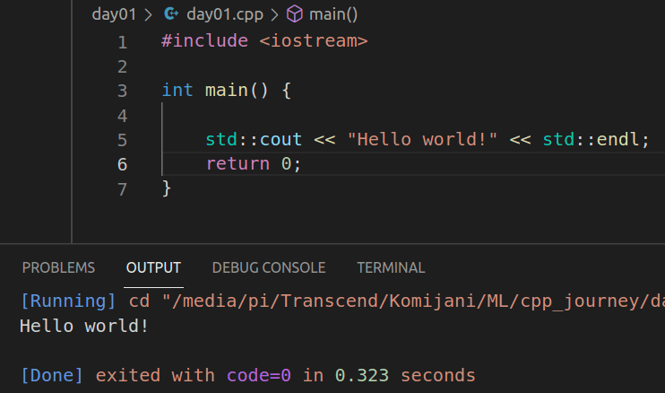 

***

<h2 align="center">
      <i class="fas fa-calendar-day" aria-hidden="true">  Day 2 of C++ journey </i>
</h2>

Creating a simple list add/delete
- [Day 02](day02)

### Lessons Learned

- [x] if / else if / else
- [x] for loop
- [x] get item from user
- [x] vectors

### Screenshots

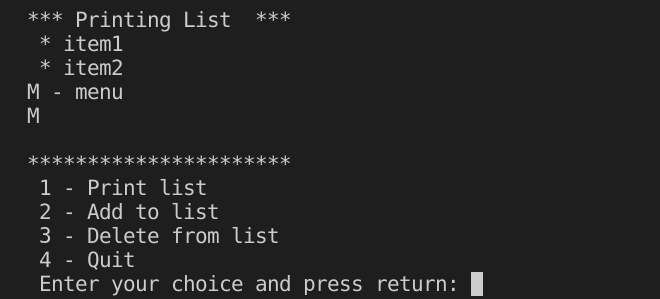 
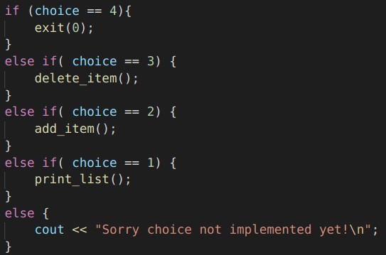 
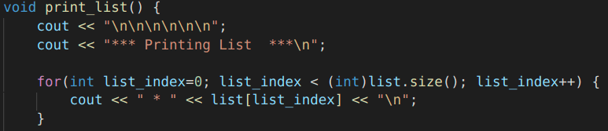 

***

<h2 align="center">
      <i class="fas fa-calendar-day" aria-hidden="true">  Day 3 of C++ journey </i>
</h2>

Creating a simple list add/delete
- [Day 03](day03)

### Lessons Learned

- [x] Class
- [x] *.h file
- [x] src & include folders

### Screenshots

list.h :

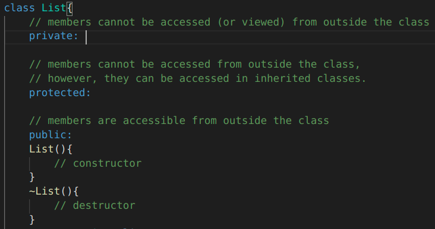

list.cpp :

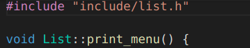

day03.cpp :

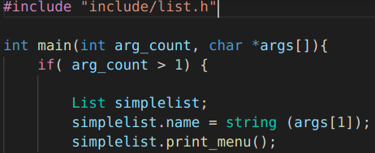

***

<h2 align="center">
      <i class="fas fa-calendar-day" aria-hidden="true">  Day 4 of C++ journey </i>
</h2>

Creating a simple multi option program
- [Day 04](day04)

### Lessons Learned

- [x] Switch
- [x] Functions

### Screenshots

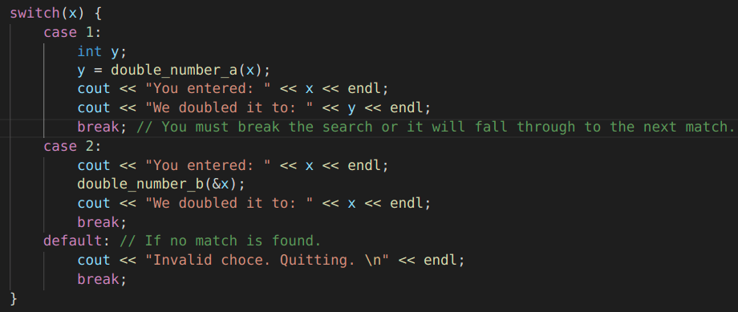

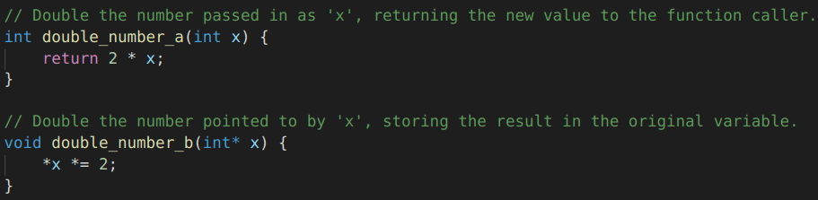

***

<h2 align="center">
      <i class="fas fa-calendar-day" aria-hidden="true">  Day 5 of C++ journey </i>
</h2>

Creating a simple multi option program
- [Day 05](day05)

### Lessons Learned

- [x] Program Arguments
- [x] goto
- [x] Integer Promotion

### Screenshots

Program Arguments:

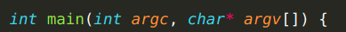
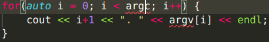

goto:

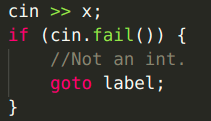
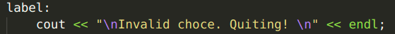

Integer Promotion:

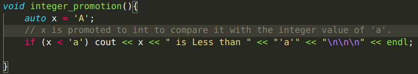

Final output:
`>> ./day05 arg1 arg2`
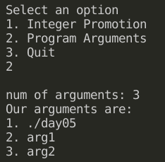

***

<h2 align="center">
      <i class="fas fa-calendar-day" aria-hidden="true">  Day 6 of C++ journey </i>
</h2>

Storage Classes in C++ with Examples

[ref: geeksforgeeks](https://www.geeksforgeeks.org/storage-classes-in-c-with-examples/)

- [Day 06](day06)

### Lessons Learned

- [x] C++ uses 5 storage classes, namely: 
    1. auto
    2. register
    3. extern
    4. static
    5. mutable

### Screenshots

| Code            | results         |  
|:---------------:|:---------------:|
|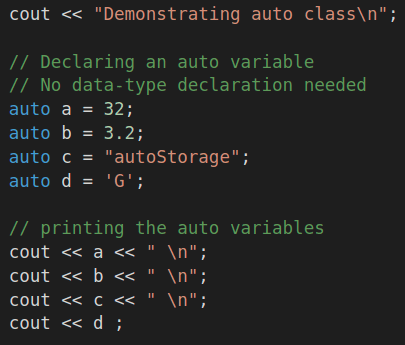 |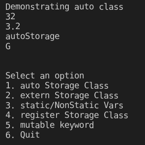|
|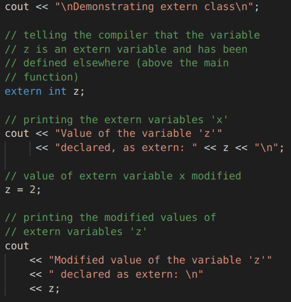 |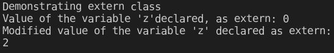|
|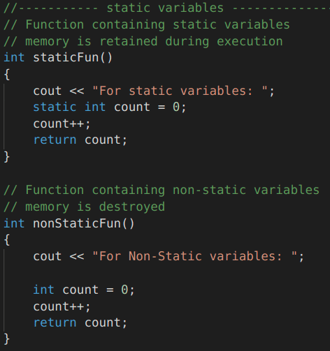 |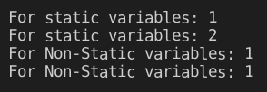|
|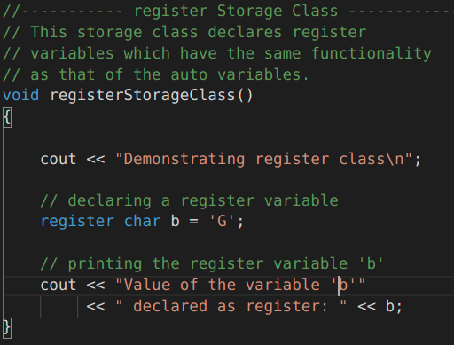 |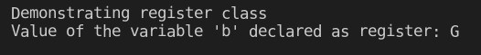|
|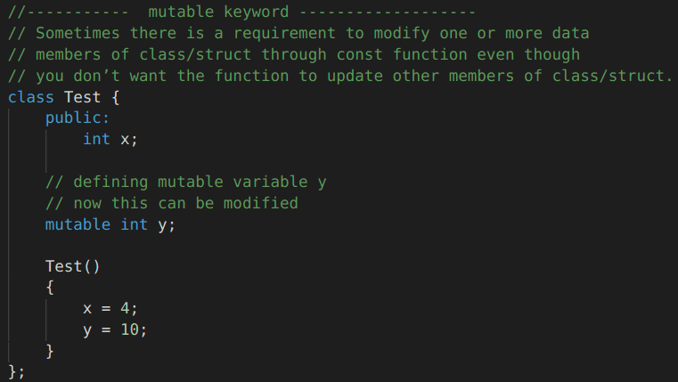 |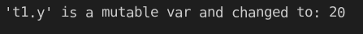|

***

<h2 align="center">
      <i class="fas fa-calendar-day" aria-hidden="true">  Day 7 of C++ journey </i>
</h2>

C++ 

- [Day 07](day07)

### Lessons Learned

- [x] Type Qualifiers
- [x] Inline function
- [x] Inline function in class
- [x] Ternary operator:
            x = (condition) ? (value_if_true) : (value_if_false);

### Screenshots

| Code            | results         |  
|:---------------:|:---------------:|
|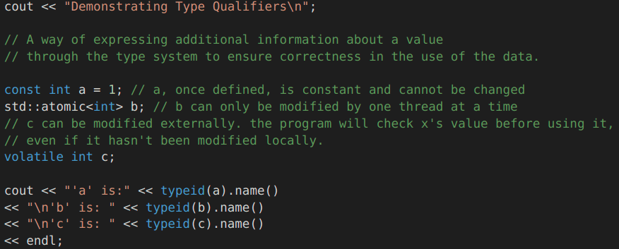 |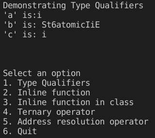|
|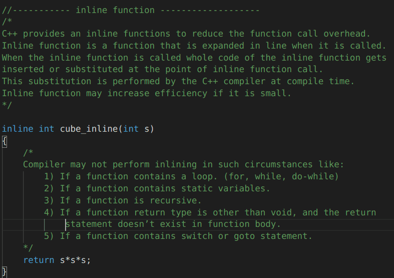 |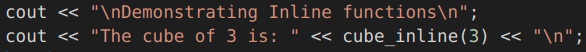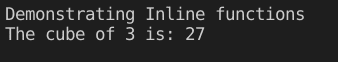|
|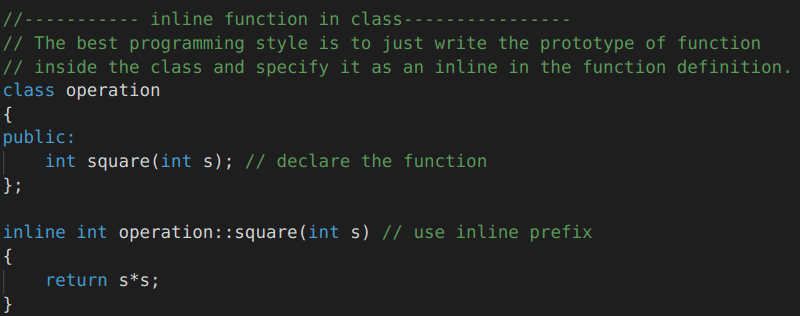 |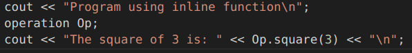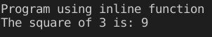|
|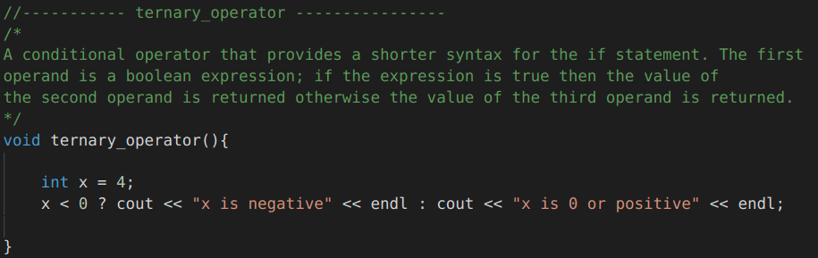 |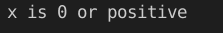|
|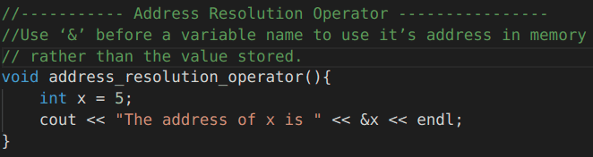 |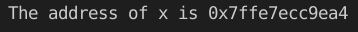|

***

<h2 align="center">
      <i class="fas fa-calendar-day" aria-hidden="true">  Day 8 of C++ journey </i>
</h2>

C++ 

- [Day 08](day08)

### Lessons Learned

- [x] address resolution operator:   ‘&’ 
- [x] Dereference Operator
- [x] Pointers
- [x] Pointer Arithmetic

### Screenshots

| Code            | results         |  
|:---------------:|:---------------:|
|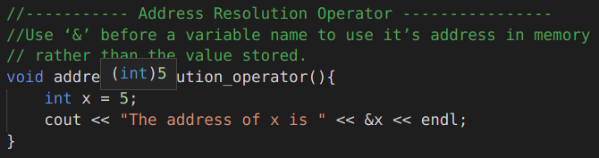 |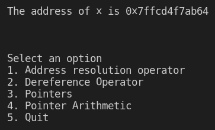|
|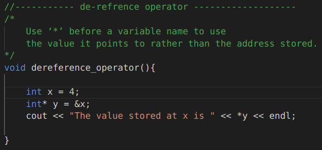 |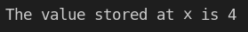|
|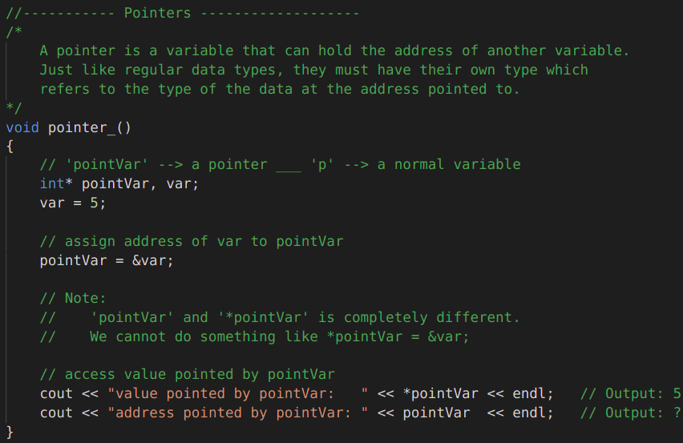 |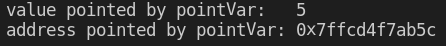|
|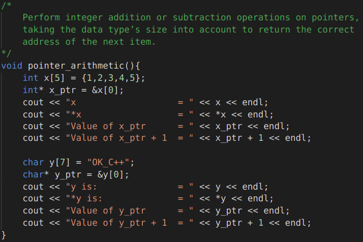 |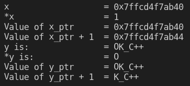|

***

<h2 align="center">
      <i class="fas fa-calendar-day" aria-hidden="true">  Day 9 of C++ journey </i>
</h2>

C++ 

- [Day 09](day09)

### Lessons Learned

- [x] Structs
- [x] Unions
- [x] Bitwise Operations
- [x] typedef

### Screenshots

| Code            | results         |  
|:---------------|:---------------:|
|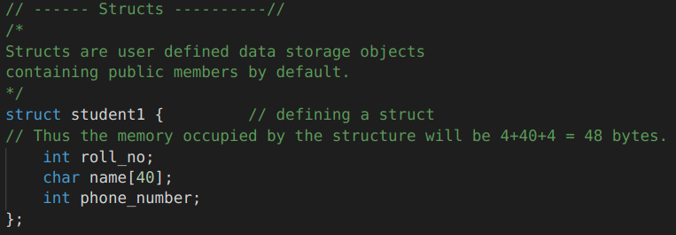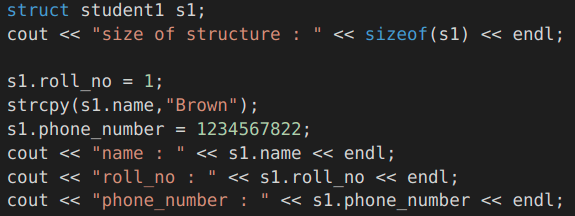|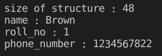 |
|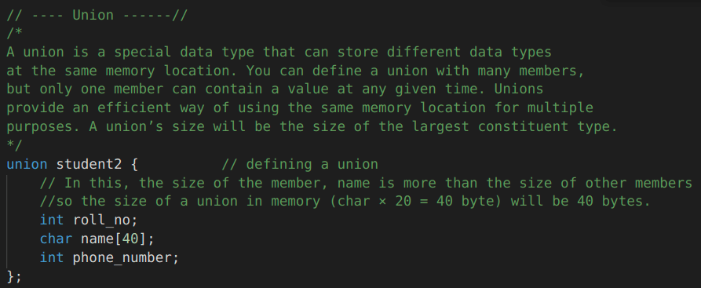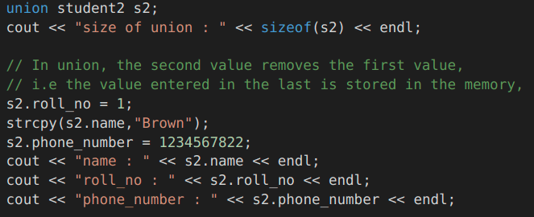| |
|||
|||

