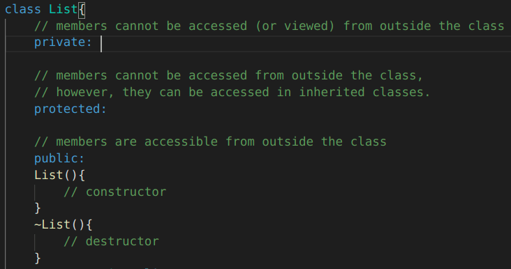
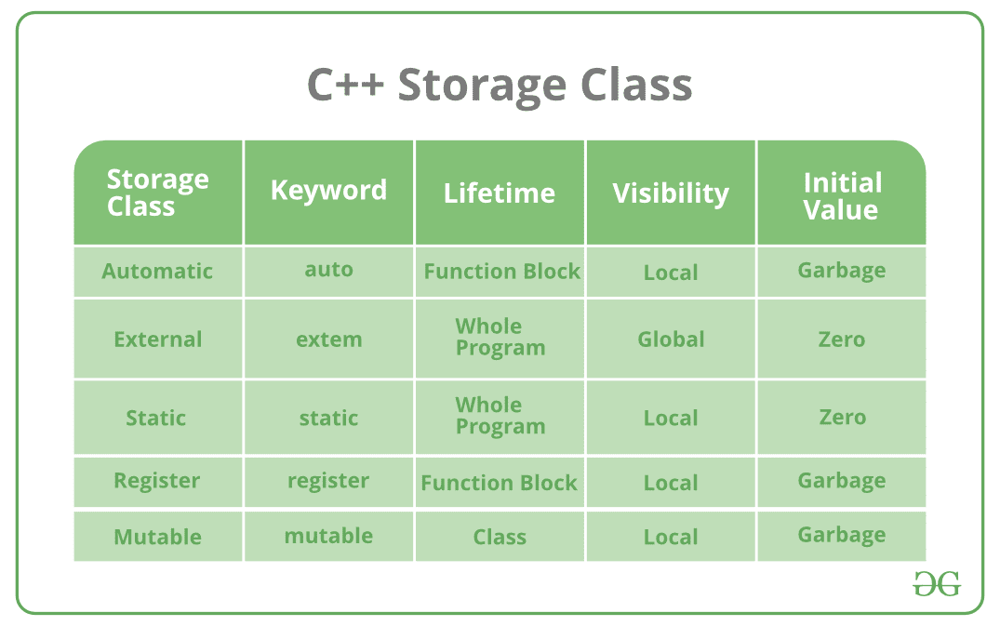
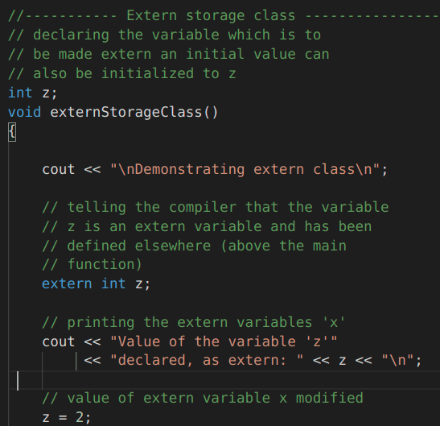

# Learning Path to C++
***
C++ is one of the most widely used programming languages worldwide.
It provides a solid basis for any programmer's skill set, and it is utilized for everything from systems-level programming to mobile app development.

This repository is for those who don't have a background in software development but wish to learn C++. 

<h2 align="center">
      <i class="fas fa-calendar-day" aria-hidden="true">  Day 1 of C++ journey </i>
</h2>

Printing "Hello world" in the terminal
- [Day 01](day01)

### Lessons Learned

- [x] iostream
- [x] Print out "Hello world!" in the terminal

### Screenshots

 

***

<h2 align="center">
      <i class="fas fa-calendar-day" aria-hidden="true">  Day 2 of C++ journey </i>
</h2>

Creating a simple list add/delete
- [Day 02](day02)

### Lessons Learned

- [x] if / else if / else
- [x] for loop
- [x] get item from user
- [x] vectors

### Screenshots

 
 
 

***

<h2 align="center">
      <i class="fas fa-calendar-day" aria-hidden="true">  Day 3 of C++ journey </i>
</h2>

Creating a simple list add/delete
- [Day 03](day03)

### Lessons Learned

- [x] Class
- [x] *.h file
- [x] src & include folders

### Screenshots

list.h :

list.cpp :

day03.cpp :

***

<h2 align="center">
      <i class="fas fa-calendar-day" aria-hidden="true">  Day 4 of C++ journey </i>
</h2>

Creating a simple multi option program
- [Day 04](day04)

### Lessons Learned

- [x] Switch
- [x] Functions

### Screenshots

***

<h2 align="center">
      <i class="fas fa-calendar-day" aria-hidden="true">  Day 5 of C++ journey </i>
</h2>

Creating a simple multi option program
- [Day 05](day05)

### Lessons Learned

- [x] Program Arguments
- [x] goto
- [x] Integer Promotion

### Screenshots

Program Arguments:

goto:

Integer Promotion:

Final output:
`>> ./day05 arg1 arg2`

***

<h2 align="center">
      <i class="fas fa-calendar-day" aria-hidden="true">  Day 6 of C++ journey </i>
</h2>

Storage Classes in C++ with Examples

[ref: geeksforgeeks](https://www.geeksforgeeks.org/storage-classes-in-c-with-examples/)

- [Day 06](day06)

### Lessons Learned

C++ uses 5 storage classes, namely: 
- [x] auto
- [x] register
- [x] extern
- [x] static
- [x] mutable

### Screenshots

| Code            | results         |  
|:---------------:|:---------------:|
| ||
| ||
| ||
| ||
| ||

